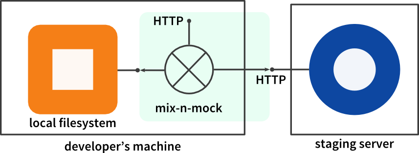

# mix-n-mock    

The configurable mixing proxy for your web development needs

## What it does

mix-n-mock is a selective proxy server that mixes local mock files from your file system with real HTTP responses from a remote server.

## Why?

Imagine Alice develops a web frontend (HTML, JS) while Bob provides the corresponding backend with HTTP services.

As the project emerges, Alice and Bob agree on an API and both start working.
Since Alice needs some sort of test data as soon as possible, she decides to throw some static dummy files to her local filesystem and set up a local web server that serves these static files.
She can now develop the frontend without having to wait for Bob’s implementation.

This is great, but at some point Bob will finish his work, so Alice should use the real service on Bob’s staging server. As the project evolves, more and more real services are available, and Alice can use them.

This is where mix-n-mock comes in handy: Alice can simply update her config file to toggle between real data and static dummy files on a per-service level.

## How is this better than an Apache httpd server with a ProxyPass?

mix-n-mock offers several advantages compared to a ProxyPass rule:

- Changes to config files are detected automatically, and the server restarts instantly
- proxied services can be [delayed](doc/usage.md#delay), i.e. you can artificially throttle individual real web services
- Static file delivery can also be [delayed](doc/usage.md#delay)
- Each HTTP method (GET, POST, PUT, DELETE) can be configured independently
- HTTP status codes can easily be generated per service, i.e. it is easy to simulate errors

## Installation

- [clone this repository][clone]
- get [Node.js][] (Version 4 or higher)
- run `npm install` in the project folder

[Node.js]: http://nodejs.org/download/ (Node.js download page)
[clone]: https://help.github.com/articles/cloning-a-repository/ (Github help)

## Usage

See [usage](doc/usage.md).

To see an example, simply run

    npm start example

and open
    
    http://localhost:8080/

in your favorite browser.
